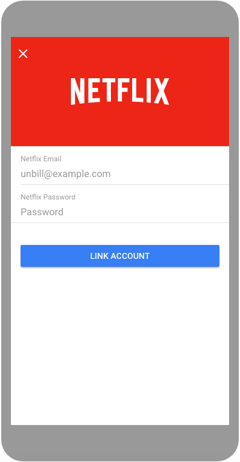
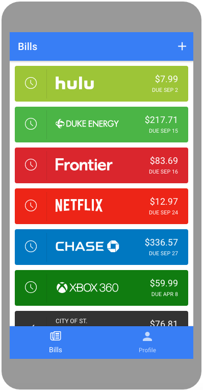
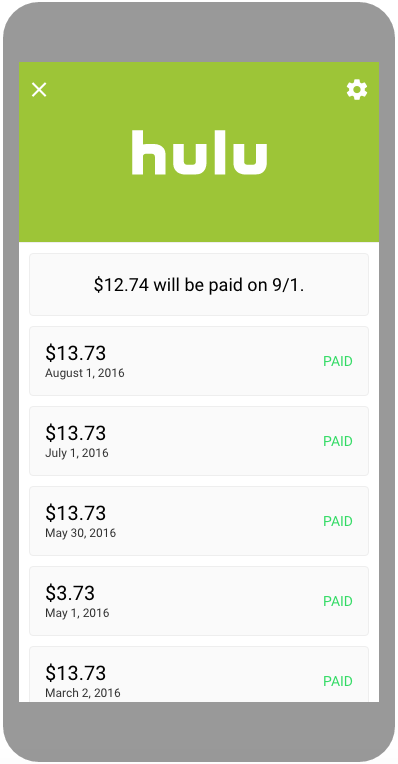
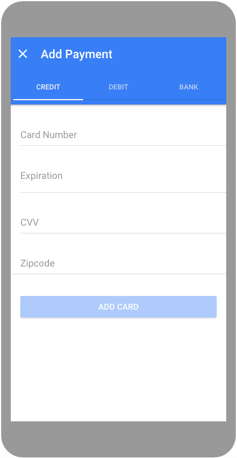
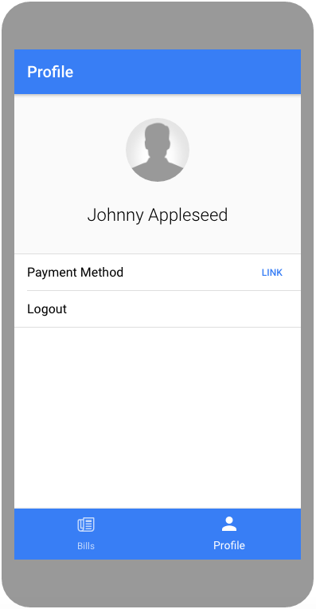

# Unbill Ionic App

This is a full fledge mobile app built with [Ionic 2](http://ionicframework.com/docs/v2/) that demonstrates how to integrate the [Unbill API](https://unbill.co/docs) into your own app.

## Live Demo

To view a live demo of the app, [tap here](https://unbill.github.io/unbill-ionic/www/) on any mobile browser. Take a look at the [known issues](#known-issues) section for current Angular 2 bugs.

## Getting Started

1. Clone the repo.

		$ git clone git@github.com:unbill/unbill-ionic.git

2. Install the [Ionic CLI](http://ionicframework.com/docs/v2/getting-started/installation/).

3. Install dependencies

        $ npm install

4. Fire up the app in your browser.

        $ cd /path/to/repo
        $ ionic serve

## What's Included

This repo contains the basic flow of how to implement all the endpoints of the [Unbill API](https://unbill.co/docs) into an application. Take a look at the code to see how you can get started with your own app!

## Screenshots

Below are sample screenshots that show the various views used with the [Unbill API](https://unbill.co/docs).

### Bill Auth

### Bill Overview

### Bill Detail

### Link Payment

### Profile

## Known Issues

* After authenticating on Safari Mobile, the due date will not show up due to a bug with Angular 2 as stated [here](https://github.com/angular/angular/issues/3333).
